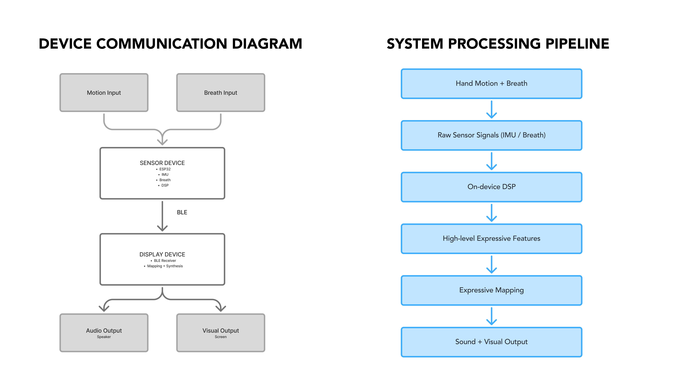

# Music Generator

This project explores a tangible approach to music interaction using pressure as the primary input and a stepper-motor-driven gauge as a physical, glanceable output.
The system allows users to control multiple instrumental layers through simple pressure input, while a mechanical gauge visualizes the overall musical intensity in real time.
Rather than focusing on melody or note-level control, the project emphasizes layered sound, intensity, and physical feedback, creating an intuitive relationship between touch, sound, and motion.

### Sensors and Input
The operation end consists of multiple identical pressure sensors (FSRs) arranged as an interactive surface.
- Sensor type: Force Sensitive Resistors
- Quantity: Five identical pressure sensors
- Input behavior: Each sensor measures how hard it is pressed, producing a continuous analog value.

Each pressure sensor is mapped to the loudness of a single instrumental layer:
- FSR 1 → Piano volume
- FSR 2 → Violin volume
- FSR 3 → Flute volume
- FSR 4 → Drum volume
- FSR 5 → Brass volume

### Display and Output
The sound output consists of pre-recorded instrumental loops rather than generative composition.The display end features a stepper-motor-driven gauge needle that provides physical feedback about the system state and a LED screen to show the animation.
The system calculates a global intensity value by aggregating the pressure readings from all sensors. This same value is used internally to mix the musical layers and is mapped directly to the angular position of the gauge needle.

### Schematics
